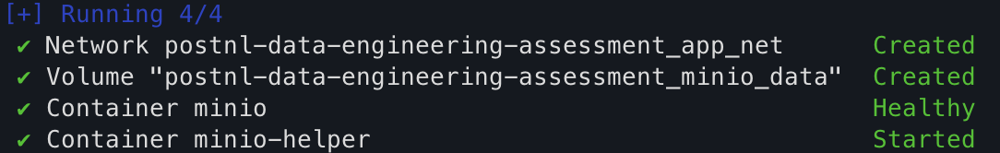

# postnl-data-engineering-assessment
This is my PostNL data engineering assessment where I design and implement a scalable data pipeline that processes transport and delivery data to improve efficiency, emissions insight, and data quality.

## Data Quality Strategy

The pipeline uses a **config-driven, schema-first** approach:

- **Bronze**: Schema enforcement from registry, format-specific handling, ingestion metadata for traceability. Corrupt records captured to quarantine when `quarantine: true`.
- **Silver**: Deduplication by business key; rows with NULL in required columns → quarantine when `quarantine: true`; timestamp normalization.
- **Gold**: Division guards for KPIs, documented units and edge cases.

Design decisions: Drop invalid rows (no quarantine path); Delta MERGE for idempotency; centralized schema registry. See [docs/DATA_QUALITY_STRATEGY.md](docs/DATA_QUALITY_STRATEGY.md) for full details.

## KPI Definitions

Gold layer `route_performance` KPIs:

| KPI | Unit | Key inputs |
|-----|------|------------|
| delay_minutes | minutes | norm_actual_arrival, norm_planned_arrival |
| arrival_status | LATE/EARLY/ON_TIME/NULL | delay_minutes |
| emission_kg | kg CO₂e | distance_km, emission_kg_per_km |
| expected_minutes | minutes | distance_km, avg_speed_kmh |
| delay_pct | ratio | delay_minutes, expected_minutes |
| efficiency_score | 0–100 | delay_pct |

See [docs/KPI_DEFINITIONS.md](docs/KPI_DEFINITIONS.md) for formulas, assumptions, and edge cases.

## Prerequisites

- **Python 3.12+** — required for the pipeline
- **Docker Desktop** — for MinIO (S3-compatible object storage)
- **Git** — for cloning the repository

> Ensure you have administrator/root privileges to install software and run Docker.

---

## Getting Started

### 1. Clone the repository

```bash
git clone https://github.com/StefanNieuwenhuis/postnl-data-engineering-assessment.git
cd postnl-data-engineering-assessment
```

**Alternative:** [Download and unzip](https://github.com/StefanNieuwenhuis/postnl-data-engineering-assessment/archive/refs/heads/main.zip) the repository ZIP, then extract and `cd` into the folder.

---

### 2. Install Python & dependencies

The project uses **[uv](https://docs.astral.sh/uv/)** for Python dependency management.

#### macOS

<details>
<summary>Installation instructions</summary>

**Option A – Homebrew (recommended)**

```bash
# Install uv
brew install uv

# Install Python 3.12 if not already installed
brew install python@3.12
```

**Option B – Official installer**

```bash
# Install uv
curl -LsSf https://astral.sh/uv/install.sh | sh

# Restart your shell or run:
source $HOME/.local/bin/env  # for bash/zsh
# or for fish: source ~/.local/share/fish/vendor_conf.d/uv.fish
```

**Option C – pip (if you already have Python 3.12)**

```bash
pip install uv
```
</details>

#### Windows

<details>
<summary>Installation instructions</summary>
**Option A – PowerShell (recommended)**

```powershell
# Install uv (run PowerShell as Administrator if needed)
powershell -ExecutionPolicy ByPass -c "irm https://astral.sh/uv/install.ps1 | iex"

# Restart PowerShell, then verify
uv --version
```

**Option B – pip**

```powershell
# Install Python 3.12 from https://www.python.org/downloads/
# During setup, check "Add Python to PATH"

pip install uv
```

**Option C – Scoop**

```powershell
scoop install uv
```
</details>


#### Install project dependencies

From the project root:

```bash
uv sync
```

This creates a `.venv` and installs all dependencies (PySpark, Delta Lake, etc.).

---

### 3. Install Docker Desktop

Docker Desktop runs MinIO and seeds the landing zone.

#### macOS

1. Download [Docker Desktop for Mac](https://docs.docker.com/desktop/install/mac-install/) (Apple Silicon or Intel).
2. Open the `.dmg` and drag Docker to Applications.
3. Run Docker Desktop and complete the setup.
4. Wait until Docker is running (whale icon in the menu bar).

#### Windows

1. Download [Docker Desktop for Windows](https://docs.docker.com/desktop/install/windows-install/).
2. Ensure [WSL 2](https://learn.microsoft.com/en-us/windows/wsl/install) is installed (required for Docker Desktop).
3. Run the installer and follow the setup wizard.
4. Restart Windows if prompted.
5. Start Docker Desktop from the Start menu.

---

### 4. Configure environment

```bash
# Copy the example environment file
cp .env.example .env

# Optional: edit .env to change MinIO credentials
# MINIO_ROOT_USER=minio
# MINIO_ROOT_PASSWORD=password
```

> **Note:** Default credentials (`minio` / `minio123`) match `config/config.yaml`. If you change `.env`, update the Spark S3A config in `config/config.yaml` (lines 107–109) accordingly.

---

### 5. Start MinIO and seed data

```bash
docker compose up -d
```

**Verify:**

- MinIO UI: http://localhost:9001  
- MinIO API: http://localhost:9000



The `minio-helper` container creates buckets (`landing`, `bronze`, `silver`, `gold`) and copies raw data from `data/raw/` into `landing/sources/`. Check:

- http://localhost:9001/browser/landing/sources

---

### 6. Run the pipeline

**Option A – Using Make (recommended)**

```bash
make run
```

**Option B – Using uv directly**

```bash
PYTHONPATH=src uv run python main.py
```

**Option C – Activate virtual environment first**

```bash
# macOS / Linux
source .venv/bin/activate

# Windows (Command Prompt)
.venv\Scripts\activate.bat

# Windows (PowerShell)
.venv\Scripts\Activate.ps1

# Then run
PYTHONPATH=src python main.py
```

---

### 7. Run tests

```bash
# Using Make (recommended)
make install   # if not already done
make test

# Or directly with uv
PYTHONPATH=src uv run pytest tests -v
```

---

### 8. Useful commands

| Command | Description |
|--------|-------------|
| `make install` | Install dependencies with uv |
| `make run` | Run the data pipeline (main.py) |
| `make test` | Run pytest |
| `make format` | Format code with black and isort |
| `make lint` | Run lint checks |
| `make clean` | Remove Python cache files |
| `docker compose down` | Stop MinIO containers |
| `docker compose up -d` | Start MinIO in background |

---

### Troubleshooting

| Issue | Solution |
|-------|----------|
| `uv: command not found` | Add uv to PATH or use the full path; on macOS with Homebrew: `brew install uv` |
| `Docker: command not found` | Install Docker Desktop and add it to PATH |
| `Connection refused` to MinIO | Ensure `docker compose up -d` has completed and MinIO is healthy |
| Port 9000 or 9001 in use | Stop the conflicting service or change ports in `docker-compose.yaml` |
| **Windows:** `python` not found | Ensure Python is added to PATH during installation; reinstall Python if needed |
| **Windows:** Script execution disabled | Run `Set-ExecutionPolicy -ExecutionPolicy RemoteSigned -Scope CurrentUser` in PowerShell |

