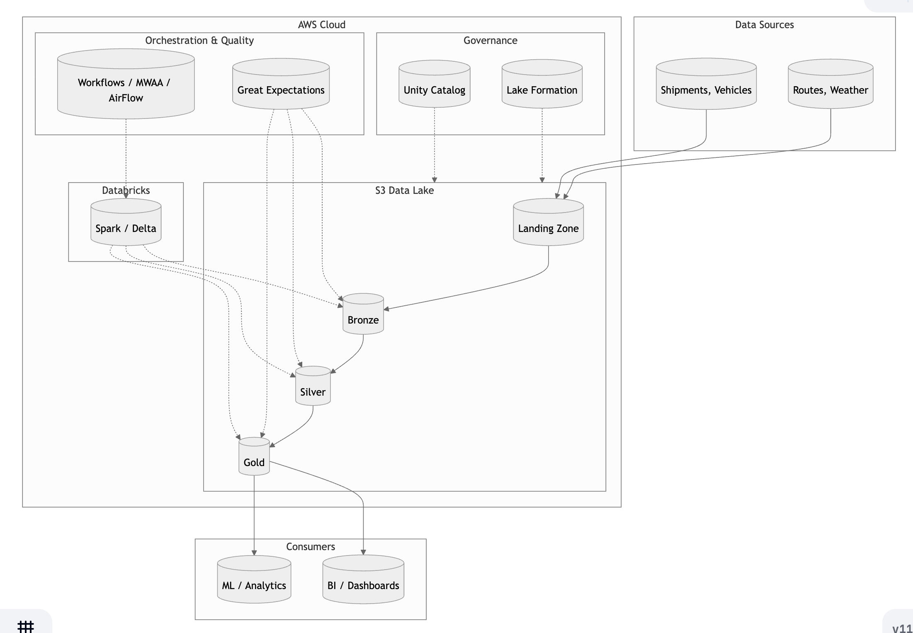

# Architecture Diagram

## 1. Overview

The data product ingests transport and delivery data from multiple sources, processes it through a medallion architecture (Bronze => Silver => Gold), and produces KPIs for route performance analysis.

| Component | Technology |
|-----------|------------|
| Storage | AWS S3 (Delta Lake format) |
| Compute & Analytics | Databricks (Spark, Delta) |
| Governance | Unity Catalog + AWS Lake Formation |
| Data Quality | Great Expectations |
| Orchestration | Databricks Workflows (primary) / Airflow MWAA (alternative) |

#### How to Read the Diagram

| Element | Meaning |
|---------|---------|
| **Solid arrows** | Primary data flow; data moves from source to landing, through bronze/silver/gold, and to consumers |
| **Dotted arrows** | Supporting or control flows; compute, orchestration, validation, and governance apply to the data without being part of the main path |

#### Data Flow

1. **Sources** — Structured (CSV) and semi-structured (JSON) data.
2. **Landing Zone** — Raw files are dropped here; no transformation. Acts as a staging area before ingestion.
3. **Bronze** — Raw data with metadata (ingestion timestamp, source file, run ID). Corrupt records go to quarantine.
4. **Silver** — Deduplicated, cleaned, and normalized. Invalid rows (e.g. missing required columns) are quarantined.
5. **Gold** — Curated KPIs (delay_minutes, emission_kg, efficiency_score) joined from shipments, routes, vehicles, and weather.
6. **Consumers** — BI tools, dashboards, and ML models consume the gold layer.

#### Supporting Components

| Component | Role |
|-----------|------|
| **Databricks (Spark / Delta)** | Compute engine for all transformations; reads, writes, and processes Delta tables in S3 |
| **Orchestration (Workflows / MWAA/ AirFlow)** | Schedules and triggers jobs; Bronze → Silver → Gold; handles retries and failures |
| **Great Expectations** | Validates data at each layer; checks schema, nulls, ranges; fails jobs on validation errors |
| **Unity Catalog** | Central metastore; table-level access control; lineage and audit |
| **Lake Formation** | S3-level permissions; resource tagging; secure sharing across AWS accounts |
